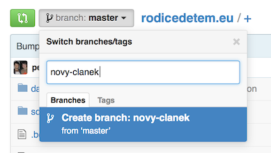
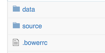
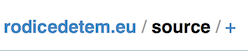
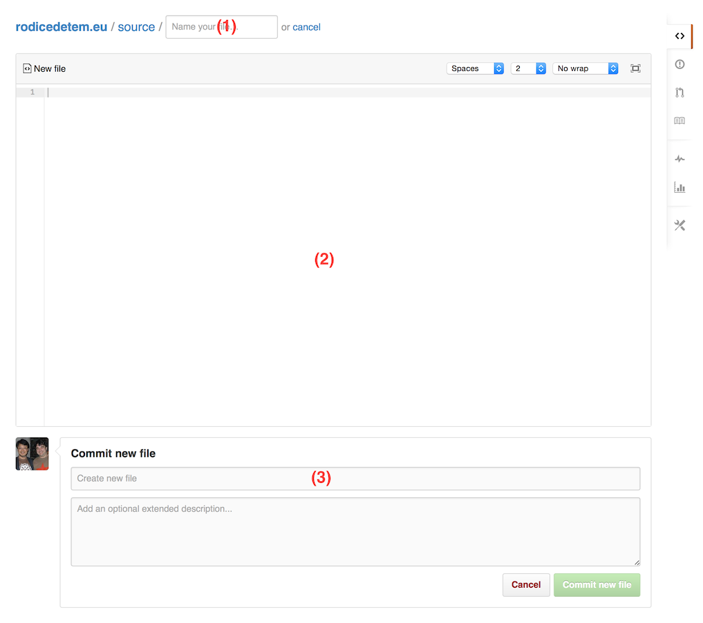

# Jak na obsah?

Je potřeba mít uživatele na stránce `http://github.com/` a být v organizaci
LastStar.

## Nová větev a adresář source

Na adrese http://github.com/LastStar/rodicedetem.eu vytvořit novou větev
. Jméno větve ve formátu
například rok-měsíc-den-nazev-bez-diakritiky (2014-08-29-clanek-o-behani).

Po vytvoření větve kliknout v přehledu adresářů na `source`
. Po přechodu do něj je možné vidět již
existující články. Je možné si jeden otevřít v novém okně, kliknout na tlačítko
RAW, pro referenci k formátu článku.

## Vytváření nového článku

V adresáři source je v cestě vedle jeho jména `+`
, kliknutím na které je možné
vytvořit nový soubor.

Po kliknutí se objeví formulář pro vytváření nového souboru
. Do jména (1) zadejte jméno souboru,
které má stejný formát jako jméno jako jméno větve výše s příponou .markdown
(2014-08-29-clanek-o-behani.markdown). Do obsahu (2) potom přímo obsah článku s
názvem v hlavičce a textem pod hlavičkou. Příklad:

```
---
title: Název článku
---

Text článku,

kdy je každý odstavce zapsán jako samostatný řádek libovolné délky.

Ale opravdu libovolné.

```

Po editaci článku je nutné ho uložit pomocí formuláře Commit new file (3) dole na
stránce. Do prvního vstupního pole se vyplní zpráva co se vytvářelo a klikne se
na tlačítko Commit new file.

